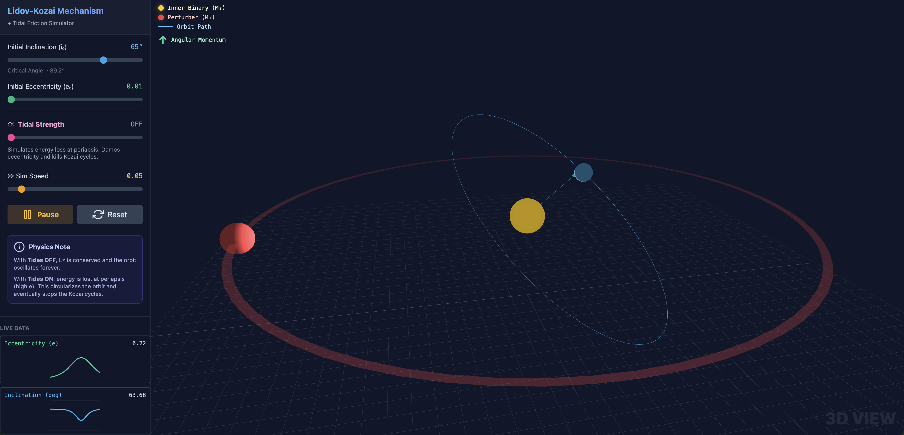

# Lidov-Kozai Mechanism Simulator

A web-based interactive simulator for the Lidov-Kozai mechanism, a dynamical phenomenon in celestial mechanics affecting the orbit of a binary system perturbed by a distant third body.

## Overview

This application visualizes the secular evolution of a hierarchical triple system. It demonstrates how a distant perturber can induce periodic oscillations in the inclination and eccentricity of an inner binary's orbit.

The simulation solves the secular equations of motion (up to quadrupole order) using a 4th-order Runge-Kutta (RK4) integrator and renders the system in 3D using `Three.js`.

## Features

-   **Interactive 3D Visualization**: View the inner binary's orbit, the angular momentum vector, and the perturber in a fully navigable 3D space.
-   **Real-time Controls**: Adjust initial inclination ($i_0$), eccentricity ($e_0$), tidal friction strength ($\eta$), and simulation speed on the fly.
-   **Live Data Plotting**: Monitor the evolution of eccentricity and inclination over time to observe the anti-correlated oscillations.

## Usage

Since this project uses CDN links for all dependencies, no build step or installation is required.

1.  Simply download the `index.html` file.
2.  Open it in any modern web browser (Chrome, Firefox, Safari, Edge).

## Dependencies

All dependencies are loaded via CDN:
-   **React 18**: UI and state management.
-   **Three.js**: 3D graphics rendering.
-   **Tailwind CSS**: Styling.
-   **Babel**: In-browser JSX compilation.

## The Physics

The Lidov-Kozai mechanism describes the exchange of angular momentum between the inner binary's eccentricity and inclination. The key conservation law in the quadrupole approximation is the vertical component of the angular momentum vector:

$$ L_z = \sqrt{1 - e^2} \cos i \approx \text{const} $$

When the initial inclination is high enough (specifically $i_0 > \arccos(\sqrt{3/5}) \approx 39.2^\circ$), the system can undergo large oscillations where the orbit becomes very eccentric as the inclination decreases, and circularizes as the inclination increases.

To simulate tidal circularization, an ad-hoc dissipative term is added to the eccentricity evolution:

$$\left(\frac{de}{dt}\right)_{tide} = -k \cdot e \cdot \frac{1}{(1-e)^3}$$

This term creates a sharp drag effect at periastron (as $e \to 1$), damping the Kozai cycles and "detuning" the resonance. 

We do not consider general relativity or octupole order effects in this simulation.
